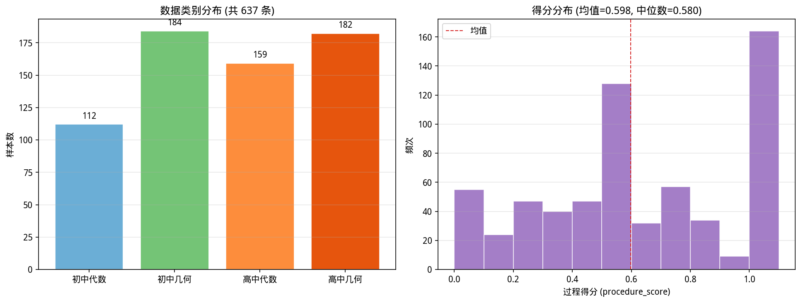
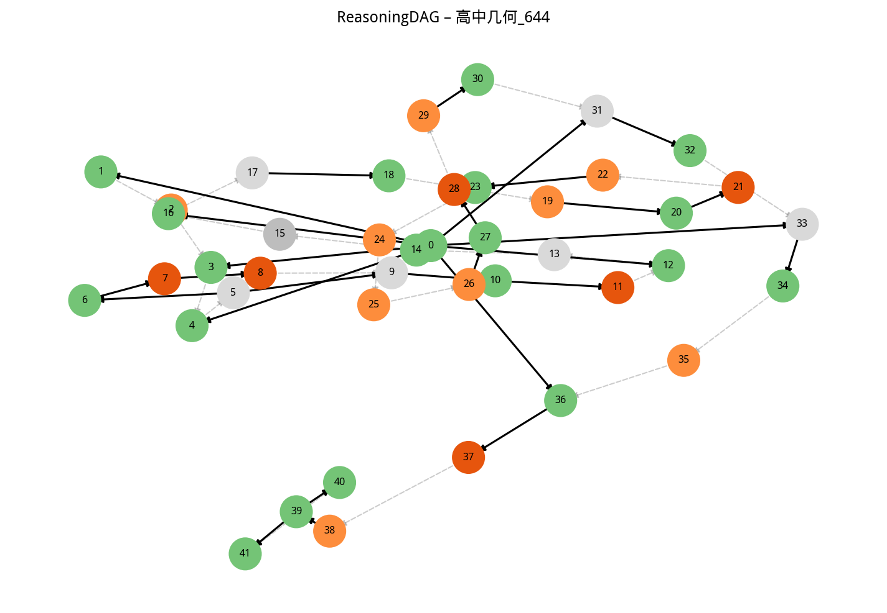
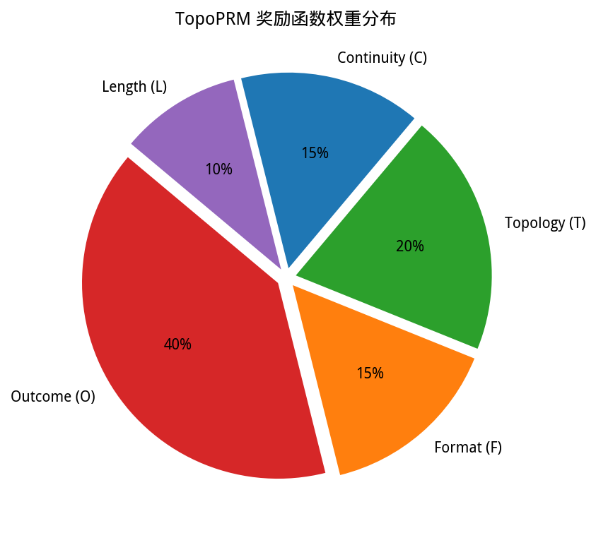
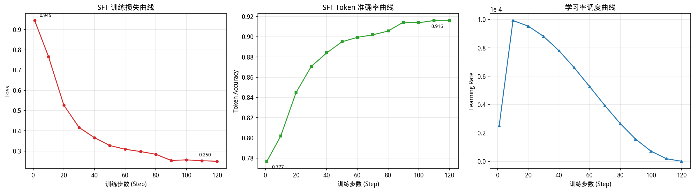

# TopoPRM — 基于拓扑过程奖励模型的高效可验证数学推理框架

TopoPRM 结合 RLVR（Reinforcement Learning with Verifiable Rewards）中的**拓扑结构奖励**与**连续性奖励**，用于训练结构感知的中文数学批改模型。通过将学生数学作答的推理过程建模为有向无环图（DAG），TopoPRM 能够在 GRPO 训练过程中提供细粒度的过程级奖励信号，鼓励模型产生结构清晰、逻辑连贯的批改推理链。

## 项目介绍

### 核心思路

传统的 outcome-only 奖励模型仅根据最终答案的正确性给出标量奖励，忽略了推理过程中的结构信息。TopoPRM 通过以下方式解决这一问题：

1. **DAG 建模**：将批改推理过程拆解为若干步骤节点，构建有向无环图（DAG），捕捉步骤间的逻辑依赖关系
2. **拓扑奖励**：评估 DAG 的结构质量——无环性、结论节点是否有依赖支撑、依赖方向一致性
3. **连续性奖励**：检查推理链中每一步的表达式/命题是否可追溯到前序步骤
4. **复合奖励**：将 5 种奖励函数加权融合，在 GRPO 训练中提供密集的过程级监督信号

### 技术栈

- **基座模型**：Qwen3-14B
- **训练框架**：ms-swift（SFT + GRPO）
- **图结构**：networkx（DAG 构建与分析）
- **微调方式**：LoRA（rank=64, alpha=128, all-linear）
- **分布式训练**：DeepSpeed ZeRO Stage 2/3

---

## 已完成工作

### 数据管线

```
691 条原始数据 → 637 条清洗后数据 → 1274 条 SFT 数据 + 637 条 GRPO 数据 + 637 个 DAG 文件
```

| 阶段 | 模块 | 输入 | 输出 |
|------|------|------|------|
| 解析原始数据 | `src.data.parse_raw` | 原始 JSON 目录 | `data/processed/parsed.jsonl` (691条) |
| 数据清洗 | `src.data.clean` | `parsed.jsonl` | `data/processed/cleaned.jsonl` (637条) |
| 构建 DAG | `src.data.build_dag` | `cleaned.jsonl` | `data/dag/*.json` (637个) |
| 准备 SFT 数据 | `src.data.prepare_sft` | `cleaned.jsonl` | `data/sft_ready/train.jsonl` (1274条) |
| 准备 GRPO 数据 | `src.data.prepare_grpo` | `cleaned.jsonl` + DAG | `data/grpo_ready/train.jsonl` (637条) |

#### 数据分布

| 类别 | 样本数 | 占比 |
|------|--------|------|
| 初中代数 | 112 | 17.6% |
| 初中几何 | 184 | 28.9% |
| 高中代数 | 159 | 25.0% |
| 高中几何 | 182 | 28.6% |



### DAG 模块

- **Node** 数据结构：step_id、raw_text、normalized_text、exprs、claims、step_type（8种）、local_verdict
- **Edge** 数据结构：source、target、edge_type（sequential/dependency）、dep_type、weight
- **ReasoningDAG**：基于 networkx.DiGraph，支持拓扑排序、环检测、孤立节点检测、DAG 验证、可视化
- **DAG 压缩**：`compress_dag` 合并冗余节点，精简 DAG 结构



### 奖励函数

5 种奖励函数，加权融合为复合奖励 $R = 0.40 \cdot O + 0.15 \cdot F + 0.20 \cdot T + 0.15 \cdot C + 0.10 \cdot L$：

| 组件 | 权重 | 说明 |
|------|------|------|
| Outcome (O) | 0.40 | 评分准确性（精确/近似匹配） |
| Format (F) | 0.15 | `<think>/<answer>` 标签 + 合法 JSON |
| Topology (T) | 0.20 | DAG 无环性、结论节点有依赖、方向一致性 |
| Continuity (C) | 0.15 | 步骤间表达式/命题的连续可追溯性 |
| Length (L) | 0.10 | 惩罚过长输出（>2000字符） |



### 消融实验配置

| 实验 ID | 奖励配置 | 目的 |
|---------|---------|------|
| `main` | 完整 TopoPRM（5组件） | 主实验 |
| `ablation_outcome_only` | 仅 outcome (w=1.0) | 基线对比 |
| `ablation_no_topo` | 去除拓扑奖励 | 验证拓扑奖励贡献 |
| `ablation_no_continuity` | 去除连续性奖励 | 验证连续性奖励贡献 |

### SFT 训练完成

- **模型**：Qwen3-14B + LoRA (rank=64, alpha=128, all-linear)
- **训练参数**：3 epochs, 120 steps, batch_size=2, grad_accum=8, DeepSpeed ZeRO3
- **最终效果**：loss 0.945 → 0.250, token_acc 0.777 → 0.916
- **训练耗时**：约 49 分钟
- **显存峰值**：107.1 GiB



### 训练日志摘要

| Step | Loss | Token Acc | Learning Rate | Epoch |
|------|------|-----------|---------------|-------|
| 1 | 0.9448 | 0.777 | 2.50e-05 | 0.03 |
| 10 | 0.7673 | 0.802 | 9.93e-05 | 0.25 |
| 20 | 0.5275 | 0.845 | 9.54e-05 | 0.50 |
| 30 | 0.4163 | 0.871 | 8.81e-05 | 0.75 |
| 40 | 0.3665 | 0.884 | 7.81e-05 | 1.00 |
| 50 | 0.3276 | 0.895 | 6.60e-05 | 1.25 |
| 60 | 0.3092 | 0.899 | 5.27e-05 | 1.50 |
| 70 | 0.2978 | 0.902 | 3.93e-05 | 1.75 |
| 80 | 0.2844 | 0.906 | 2.66e-05 | 2.00 |
| 90 | 0.2538 | 0.914 | 1.56e-05 | 2.25 |
| 100 | 0.2568 | 0.914 | 7.16e-06 | 2.50 |
| 110 | 0.2523 | 0.916 | 1.82e-06 | 2.75 |
| 120 | 0.2497 | 0.916 | 0.00e+00 | 3.00 |

### 单元测试

全部 **86/86** 测试通过（`tests/` 目录）：

```bash
pytest tests/ -v  # 测试覆盖：DAG、奖励函数、数据解析、DAG 构建
```

---

## 实验状态

| 阶段 | 状态 | 说明 |
|------|------|------|
| 数据管线 | ✅ 已完成 | 637条清洗数据，1274条SFT，637条GRPO |
| SFT 训练 | ✅ 已完成 | Qwen3-14B LoRA, 120 steps |
| GRPO 主实验 | ⏳ 进行中 | 完整 TopoPRM 奖励 |
| 消融实验 | 📋 待开始 | outcome-only, no-topo, no-continuity |
| 蒸馏实验 | 📋 待开始 | 逆向 KL 蒸馏到 Qwen3-7B / 1.5B |
| 基准评估 | 📋 待开始 | MATH, GSM8K, CMATH, GaoKao, C-Eval-Math |

---

## Quick Start

### 环境安装

```bash
cd /mnt/users/rwl/topoprm
conda create -n topoprm python==3.12
conda activate topoprm
pip install -r requirements.txt
pip install -e .
```

### 设置 PYTHONPATH

```bash
export PYTHONPATH="$(pwd):${PYTHONPATH:-}"
```

### 数据管线

```bash
bash scripts/run_data_pipeline.sh
```

### SFT 训练

```bash
bash scripts/run_sft.sh
# 等价于: swift sft --config configs/sft_qwen3_14b.yaml
```

### GRPO 训练

```bash
bash scripts/run_grpo.sh
# 等价于: swift rlhf --rlhf_type grpo --config configs/grpo_qwen3_14b.yaml
```

### 评估

```bash
bash scripts/run_eval.sh
```

### 生成可视化图表

```bash
python3 scripts/generate_visualizations.py
# 图表保存至 docs/figures/
```

### 运行测试

```bash
pytest tests/ -v
```

---

## 项目结构

```
topoprm/
├── src/
│   ├── dag/                    # DAG 数据结构
│   │   ├── node.py             #   Node / Edge 数据类, StepType 枚举
│   │   ├── graph.py            #   ReasoningDAG（networkx 有向无环图）
│   │   └── compress.py         #   DAG 压缩算法
│   ├── data/                   # 数据管线
│   │   ├── parse_raw.py        #   解析原始 JSON 数据
│   │   ├── clean.py            #   数据清洗与过滤
│   │   ├── build_dag.py        #   从批改结果构建 DAG
│   │   ├── prepare_sft.py      #   生成 SFT 训练格式数据
│   │   ├── prepare_grpo.py     #   生成 GRPO 训练格式数据
│   │   └── merge_datasets.py   #   合并中英文数据集
│   ├── reward/                 # 奖励函数
│   │   ├── outcome_reward.py   #   评分准确性奖励
│   │   ├── format_reward.py    #   格式合规奖励
│   │   ├── topo_reward.py      #   拓扑结构奖励
│   │   ├── continuity_reward.py#   推理连续性奖励
│   │   └── composite_reward.py #   复合奖励（含长度惩罚）
│   └── eval/                   # 评估模块
│       ├── benchmark_runner.py #   基准测试运行器
│       └── critique_eval.py    #   批改质量评估
├── configs/                    # ms-swift 训练配置
│   ├── sft_qwen3_14b.yaml     #   SFT 配置
│   ├── grpo_qwen3_14b.yaml    #   GRPO 配置
│   └── eval_config.yaml        #   评估配置
├── experiments/                # NeurIPS 实验脚本
│   ├── run_main.sh             #   主实验
│   ├── run_ablation_*.sh       #   消融实验
│   └── run_distill.sh          #   蒸馏实验
├── scripts/                    # 工具脚本
│   ├── run_data_pipeline.sh    #   数据管线一键运行
│   ├── run_sft.sh              #   SFT 训练启动
│   ├── run_grpo.sh             #   GRPO 训练启动
│   ├── run_eval.sh             #   评估启动
│   └── generate_visualizations.py  #   生成可视化图表
├── docs/                       # 文档
│   ├── figures/                #   可视化图表
│   ├── dag_schema.md           #   DAG 数据格式说明
│   ├── reward_design.md        #   奖励函数设计文档
│   ├── training_pipeline.md    #   训练管线文档
│   └── progress.md             #   工作进展文档
├── tests/                      # 单元测试（86 个）
├── data/                       # 数据目录
│   ├── processed/              #   处理后数据
│   ├── dag/                    #   DAG JSON 文件
│   ├── sft_ready/              #   SFT 训练数据
│   ├── grpo_ready/             #   GRPO 训练数据
│   └── benchmarks/             #   评估基准数据集
├── output/                     # 训练输出
│   ├── sft_qwen3_14b/          #   SFT 检查点
│   └── grpo_main/              #   GRPO 检查点
├── GRP_paper/                  # 论文 LaTeX 源文件
├── requirements.txt
├── setup.py
├── README.md                   # English README
└── README_zh.md                # 中文 README（本文件）
```

---

## 参考资料

- [ms-swift](https://github.com/modelscope/ms-swift) — 训练框架
- [Qwen3](https://huggingface.co/Qwen/Qwen3-14B) — 基座模型
- [networkx](https://networkx.org/) — 图数据结构
- [DeepSpeed](https://github.com/microsoft/DeepSpeed) — 分布式训练

---

## License

本项目仅供研究使用。
