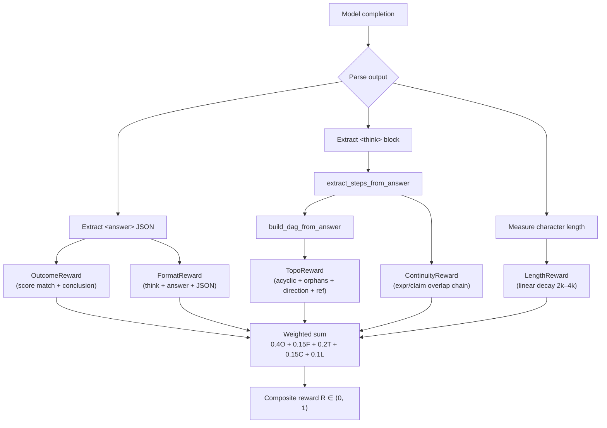

# TopoPRM Reward Design

## Motivation

Traditional outcome-only reward models assign a single scalar to the final answer, ignoring **how** the model arrived at it. This creates several problems:

1. **Credit-assignment ambiguity** — a correct final answer may hide flawed intermediate reasoning, and an incorrect answer may contain mostly valid steps. A single reward offers no gradient signal to improve the reasoning process itself.
2. **Structural reasoning matters** — mathematical proofs and critiques are not flat sequences of tokens; they form directed acyclic graphs (DAGs) of logical dependencies. A model that produces well-structured reasoning — where each conclusion is grounded in prior derivations — generalises better than one that memorises surface patterns.
3. **Format compliance is trainable** — reinforcement-learning can shape not just correctness but also the format of the output (e.g., `<think>` / `<answer>` blocks with valid JSON), reducing the need for post-processing.

TopoPRM addresses these issues with a **five-component composite reward** that provides dense, process-level supervision during GRPO training.

---

## Reward Components

### 1. Outcome Reward — weight `w_O = 0.40`

Evaluates the correctness of the predicted score and critique conclusion against the ground-truth solution.

**Scoring rubric (additive, raw max = 1.5):**

| Condition | Raw points |
|---|---|
| Predicted score equals ground-truth score exactly | +1.0 |
| Predicted score within ±1 of ground truth | +0.5 |
| `结论批改` (conclusion) matches ground truth exactly | +0.5 |

$$
O_{\text{raw}} = \mathbb{1}[\hat{s} = s^*] \cdot 1.0 \;+\; \mathbb{1}[|\hat{s} - s^*| \le 1] \cdot 0.5 \;+\; \mathbb{1}[\hat{c} = c^*] \cdot 0.5
$$

The raw score is capped at 1.5 and normalised to \[0, 1\]:

$$
O = \frac{\min(O_{\text{raw}},\; 1.5)}{1.5}
$$

**Implementation:** `OutcomeReward` in `src/reward/outcome_reward.py`. Parses the `<answer>` JSON block for fields `学生得分` / `score` and `结论批改` / `conclusion`.

---

### 2. Format Reward — weight `w_F = 0.15`

Checks structural compliance of the model output with the expected `<think>…</think><answer>{JSON}</answer>` template.

| Output structure | Score |
|---|---|
| `<think>` block **+** `<answer>` with valid JSON | **1.0** |
| `<answer>` with valid JSON (no `<think>`) | **0.3** |
| Anything else | **0.0** |

$$
F = \begin{cases}
1.0 & \text{if } \texttt{<think>} \wedge \texttt{<answer>\{JSON\}} \\
0.3 & \text{if } \texttt{<answer>\{JSON\}} \text{ only} \\
0.0 & \text{otherwise}
\end{cases}
$$

**Implementation:** `FormatReward` in `src/reward/format_reward.py`.

---

### 3. Topology Reward — weight `w_T = 0.20`

Evaluates the structural quality of the reasoning DAG extracted from the `<think>` block. This is the **core innovation** of TopoPRM.

| Sub-criterion | Points | Condition |
|---|---|---|
| Base | 0.4 | Extractable reasoning steps present |
| Acyclicity | +0.2 | DAG has no cycles (`nx.is_directed_acyclic_graph`) |
| No orphan conclusions | +0.2 | Every conclusion node has ≥ 1 dependency predecessor |
| Direction consistency | +0.1 | Fraction of dependency edges `(u, v)` where `u < v` (forward direction) |
| Reference overlap | +coverage × 0.1 | Fraction of reference-DAG dependency edges covered (when `reference_dag` is provided) |

$$
T = \min\!\Big(0.4 + 0.2 \cdot \mathbb{1}[\text{acyclic}] + 0.2 \cdot \mathbb{1}[\text{no orphan concl.}] + 0.1 \cdot d_{\text{dir}} + 0.1 \cdot c_{\text{ref}},\; 1.0\Big)
$$

where:
- \(d_{\text{dir}} = \frac{|\{(u,v) \in E_{\text{dep}} : u < v\}|}{|E_{\text{dep}}|}\) is the direction consistency ratio
- \(c_{\text{ref}} = \frac{|E_{\text{dep}}^{\text{pred}} \cap E_{\text{dep}}^{\text{ref}}|}{|E_{\text{dep}}^{\text{ref}}|}\) is the reference coverage

**Implementation:** `TopoReward` in `src/reward/topo_reward.py`. Uses `build_dag_from_answer` to construct a `ReasoningDAG` from the think block, then evaluates each sub-criterion.

---

### 4. Continuity Reward — weight `w_C = 0.15`

Measures whether each reasoning step is traceable to a prior step or to the given conditions (表达式/命题的连续性).

A step is **continuous** if any of:
- It contains a "given" marker (`已知`, `given`, `由题意`, etc.)
- It has no extractable expressions or claims (transitional text)
- Its expressions or claims overlap with those of a prior step

$$
C = \begin{cases}
1.0 & \text{if } n_{\text{cont}} = n_{\text{total}} \\
0.8 \cdot \dfrac{n_{\text{cont}}}{n_{\text{total}}} & \text{otherwise}
\end{cases}
$$

The 0.8 multiplier penalises chains that contain any discontinuous step.

**Implementation:** `ContinuityReward` in `src/reward/continuity_reward.py`.

---

### 5. Length Reward — weight `w_L = 0.10`

Penalises excessively long completions to encourage concise reasoning.

| Character count | Score |
|---|---|
| ≤ 2000 | 1.0 |
| 2000–4000 | Linear decay from 1.0 → 0.0 |
| > 4000 | 0.0 |

$$
L = \begin{cases}
1.0 & \text{if } \ell \le 2000 \\
1 - \dfrac{\ell - 2000}{2000} & \text{if } 2000 < \ell < 4000 \\
0.0 & \text{if } \ell \ge 4000
\end{cases}
$$

**Implementation:** `LengthReward` in `src/reward/composite_reward.py`.

---

## Composite Reward

All five components are combined into a single scalar:

$$
R = 0.40 \cdot O + 0.15 \cdot F + 0.20 \cdot T + 0.15 \cdot C + 0.10 \cdot L
$$

| Component | Symbol | Weight | Range |
|---|---|---|---|
| Outcome | O | 0.40 | [0, 1] |
| Format | F | 0.15 | {0.0, 0.3, 1.0} |
| Topology | T | 0.20 | [0, 1] |
| Continuity | C | 0.15 | [0, 1] |
| Length | L | 0.10 | [0, 1] |
| **Composite** | **R** | **1.00** | **[0, 1]** |

**Implementation:** `TopoCompositeReward` in `src/reward/composite_reward.py`.

---

## Ablation Suggestions

| Experiment ID | Ablation | Expected effect |
|---|---|---|
| A1 | Remove topology reward (set `w_T = 0`) | Baseline; isolate topo contribution |
| A2 | Remove continuity reward (set `w_C = 0`) | Measure continuity's independent value |
| A3 | Outcome-only (`w_O = 1.0`, rest 0) | Pure outcome RL baseline |
| A4 | Equal weights (all 0.20) | Test weight sensitivity |
| A5 | Double topo weight (`w_T = 0.40`, halve `w_O = 0.20`) | Explore topo-dominant training |
| A6 | Remove length penalty (set `w_L = 0`) | Measure verbosity drift |
| A7 | No reference DAG (omit `reference_dag` from data) | Weak-supervision-only topo signal |
| A8 | Stricter format (F only ∈ {0, 1}) | Remove partial format credit |

---

## ms-swift Integration

TopoPRM rewards integrate with [ms-swift](https://github.com/modelscope/ms-swift) via its ORM (Outcome Reward Model) plugin system.

### Registration

All reward classes inherit from `swift.rewards.ORM` and are registered in the global `orms` dictionary:

```python
from swift.rewards import ORM, orms

class TopoCompositeReward(ORM):
    def __call__(self, completions, **kwargs):
        ...

orms["topo_composite"] = TopoCompositeReward
```

### Loading via `external_plugins`

In the GRPO config YAML:

```yaml
external_plugins: src/reward/composite_reward.py
reward_funcs:
  - topo_composite
```

When ms-swift starts GRPO training, it imports the file specified by `external_plugins`, which triggers the module-level `orms[...] = ...` registrations. The `reward_funcs` list tells GRPO which registered ORM to use.

### Registered names

| ORM key | Class |
|---|---|
| `topo_composite` | `TopoCompositeReward` |
| `topo_outcome` | `OutcomeReward` |
| `topo_format` | `FormatReward` |
| `topo_topo` | `TopoReward` |
| `topo_continuity` | `ContinuityReward` |
| `topo_length` | `LengthReward` |

---

## Reward Computation Flow



---

## Known Limitations

1. **Topology extraction is heuristic** — Step splitting relies on newline boundaries; multi-line steps or inline sub-arguments may be missed.
2. **Dependency detection is rule-based** — The LLM-based dependency builder (`build_dependency_edges_by_llm`) is a placeholder that falls back to rules. Stronger supervision would improve the topo signal.
3. **Chinese-centric patterns** — Expression/claim extraction and step-type classification patterns are tuned for Chinese math notation. Extending to other languages requires additional regex rules.
4. **Reference DAG availability** — The reference-overlap sub-criterion of the topo reward requires pre-built DAGs. Records without a matching DAG file receive an empty DAG, disabling this sub-signal.
5. **Format reward is coarse** — Only three discrete values (0.0, 0.3, 1.0) are used; finer-grained JSON schema validation could provide a richer signal.
6. **No per-step reward** — Despite extracting individual steps, all rewards are still computed at the completion level. True step-level PRM would require per-node credit assignment.
